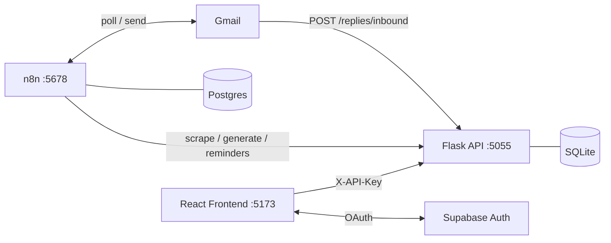

# Job Hunter KE — Claude Code Context

Automated job and scholarship application SaaS targeting Kenya. The system scrapes listings, generates tailored documents with AI, routes them to a React dashboard for review, and dispatches approved applications via n8n.

## Architecture



## Running the project

```bash
# Backend (activate venv first)
python api_server.py

# n8n + Postgres only
docker compose up -d n8n postgres

# Frontend
cd frontend && npm run dev

# Full stack
docker compose up -d --build
```

In n8n workflows, reach the local Flask server at `http://host.docker.internal:5055`.

## Backend key files

| File | Purpose |
|------|---------|
| `api_server.py` | All endpoints, auth middleware, background task runner |
| `db.py` | SQLite layer — tables: jobs, scholarships, tasks, profiles, replies |
| `ai_engine.py` | OpenAI-compatible AI client (Groq/OpenRouter/Together/Ollama) |
| `email_dispatch.py` | SMTP/SendGrid — review notifications, reminder digest |
| `scrapers.py` | Kenya job board scrapers |
| `scholarship_scrapers.py` | Scholarship site scrapers |

## Frontend key files

| File | Purpose |
|------|---------|
| `src/api/client.ts` | Axios — reads API key via `useAuthStore.getState()` (not localStorage) |
| `src/lib/supabase.ts` | Supabase client with graceful fallback when env vars missing |
| `src/pages/Setup.tsx` | Split-panel login (Supabase Auth — email, magic link, Google OAuth) |
| `src/pages/Settings.tsx` | Scraping defaults + reminder preferences with live preview |
| `src/store/auth.ts` | Zustand: apiKey + userId only (no Supabase session persisted) |
| `src/components/jobs/RepliesTab.tsx` | Employer reply inbox with category badges + AI draft |

## Auth flow

1. User logs in via Supabase (email/password, magic link, or Google OAuth)
2. On success → call Flask `POST /profile/setup` (first time) or `GET /profile`
3. Get `api_key` → store in Zustand via `setAuth()`
4. All Flask calls use `X-API-Key` header — Flask never sees Supabase tokens

## Tailwind CSS v4 — critical note

This project uses **Tailwind v4** which requires the `@tailwindcss/vite` plugin:
- `vite.config.ts` must import and use `tailwindcss` from `@tailwindcss/vite`
- `src/index.css` must use `@import "tailwindcss"` (not `@import "shadcn/tailwind.css"`)
- Do NOT use a PostCSS config for Tailwind v4

## n8n workflows

| File | Trigger | Purpose |
|------|---------|---------|
| `n8n_workflow.json` | Schedule | Scrape → generate docs → email for review → dispatch |
| `n8n_reminder_workflow.json` | Daily 8am (weekdays) | Deadline reminder digest email |
| `n8n_email_reply_workflow.json` | Gmail poll (1 min) | Detect employer replies → classify → AI draft |

## Design system

- **Primary:** Violet `#6d28d9` (light) / `#8b5cf6` (dark)
- **Status colors:** Gray (pending) · Amber (ready_for_review) · Blue (approved) · Green (dispatched/done) · Red (rejected/failed) · Indigo pulse (running)
- **Font:** Inter Variable

## DB tables

`jobs` · `scholarships` · `tasks` · `profiles` · `replies`

The `replies` table stores inbound employer emails with fields: `category` (interview_invite / offer / info_request / rejection / acknowledgement / unknown), `ai_draft`, `is_read`.

## Environment variables

See `.env.example` for the full list. Minimum required:
```
API_KEY=               # Flask auth key
GROQ_API_KEY=          # or OPENROUTER_API_KEY
REVIEW_RECIPIENT_EMAIL=
SMTP_USER= / SMTP_PASS=
```

Frontend `.env`:
```
VITE_API_BASE_URL=http://localhost:5055
VITE_SUPABASE_URL=
VITE_SUPABASE_ANON_KEY=
```
