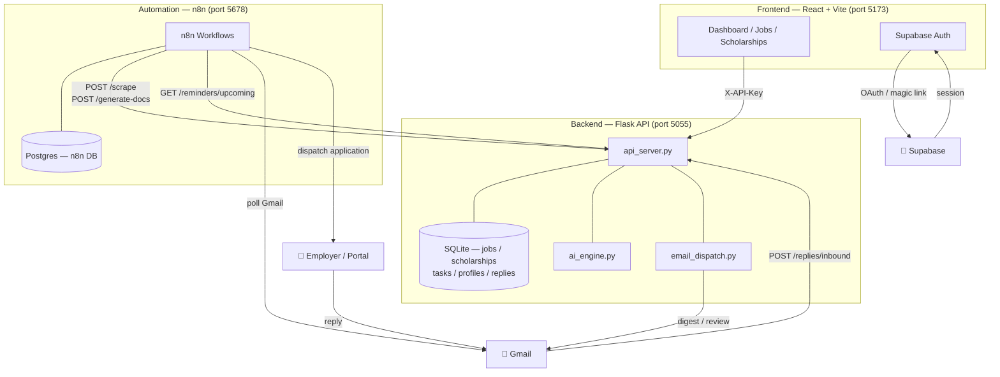
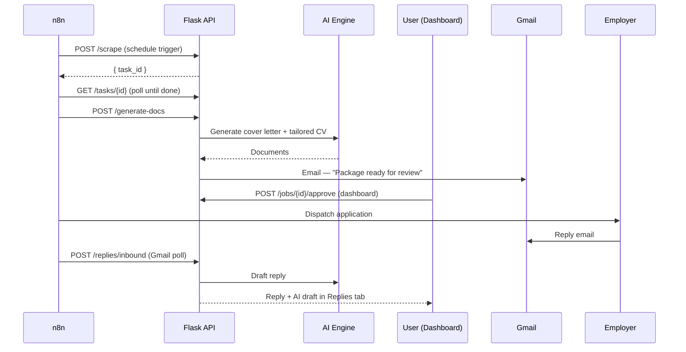
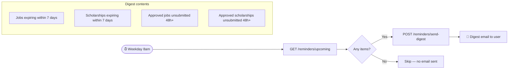
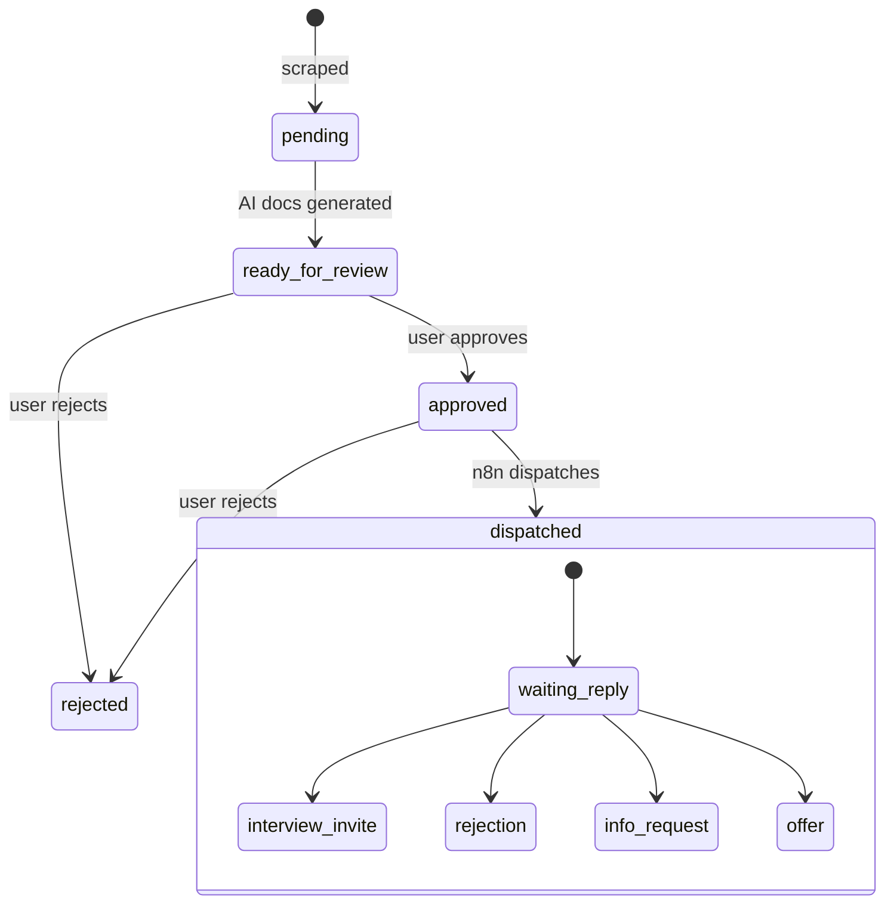
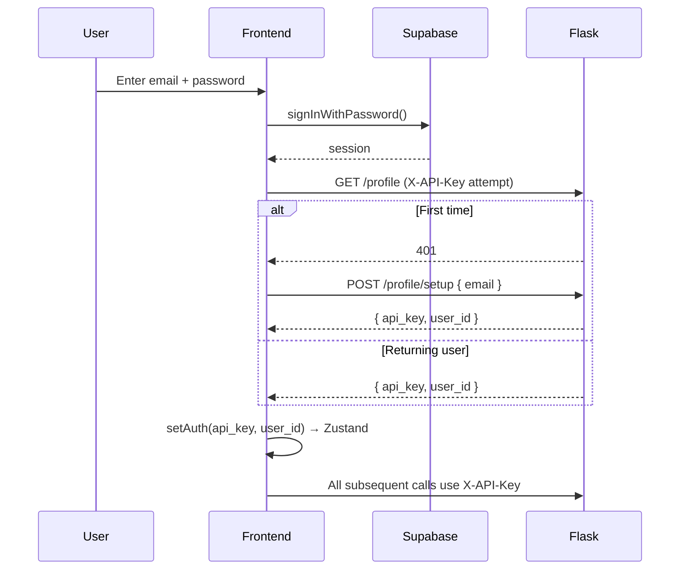
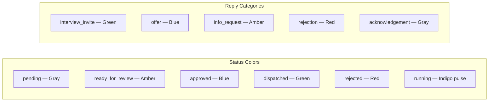

# Job Hunter KE

An automated job and scholarship application system for the Kenyan market. Scrapes listings, generates tailored cover letters and CVs using AI, routes them to a review dashboard, and dispatches approved applications — orchestrated by n8n.

---

## System Architecture



---

## End-to-End Application Flow



---

## Daily Reminder Flow



---

## Status Model



---

## Project Structure

```
jobappagent/
├── api_server.py                  # Flask REST API
├── db.py                          # SQLite — jobs, scholarships, tasks, profiles, replies
├── ai_engine.py                   # OpenAI-compatible AI (Groq / OpenRouter / Ollama)
├── scrapers.py                    # Job board scrapers (BrighterMonday, Fuzu, LinkedIn …)
├── scholarship_scrapers.py        # Scholarship scrapers (Chevening, Mastercard, DAAD …)
├── email_dispatch.py              # SMTP / SendGrid notifications + reminder digest
├── pdf_export.py                  # Markdown → PDF via WeasyPrint
├── Dockerfile                     # Python 3.11-slim production image
├── docker-compose.yml             # api + n8n + postgres
├── n8n_workflow.json              # Core scrape → generate → notify workflow
├── n8n_reminder_workflow.json     # Daily deadline reminder digest
├── n8n_email_reply_workflow.json  # Gmail reply handler
├── .env.example                   # All config variables documented
├── CLAUDE.md                      # Claude Code context (auto-loaded)
├── SPECS.md                       # Full UI specification
└── frontend/                      # React dashboard
```

---

## Running the Project

### Backend only

```bash
python -m venv venv && source venv/bin/activate
pip install -r requirements.txt
cp .env.example .env        # fill in your keys
python api_server.py        # → http://localhost:5055
```

### n8n + Postgres only (recommended for local dev)

```bash
docker compose up -d n8n postgres
# n8n → http://localhost:5678
# In n8n workflows, reach the local Flask API at http://host.docker.internal:5055
```

### Full stack

```bash
docker compose up -d --build
```

---

## Backend

### Stack

| Layer | Technology |
|-------|-----------|
| API | Flask 3.x + Flask-CORS + Flask-Limiter |
| Database | SQLite (WAL mode, multi-reader) |
| Auth | `X-API-Key` header — single-user (env) or multi-tenant (DB-backed) |
| AI | OpenAI-compatible — Groq, OpenRouter, Together AI, or Ollama |
| Background tasks | `ThreadPoolExecutor(4)` with DB-tracked task status |
| Email | SMTP or SendGrid |
| PDF export | WeasyPrint (Markdown → HTML → PDF) |
| Scraping | requests + BeautifulSoup4, feedparser, PRAW (Reddit) |
| Automation | n8n (self-hosted) |

### Environment Variables

```env
# Auth
API_KEY=your-secret-key

# AI provider (pick one)
GROQ_API_KEY=gsk_...
OPENROUTER_API_KEY=...
AI_MODEL=llama3-8b-8192

# Email
REVIEW_RECIPIENT_EMAIL=you@example.com
EMAIL_PROVIDER=smtp                    # smtp | sendgrid
SMTP_HOST=smtp.gmail.com
SMTP_PORT=587
SMTP_USER=you@gmail.com
SMTP_PASS=app-password

# n8n
N8N_WEBHOOK_SECRET=hmac-secret        # optional HMAC verification

# Docker / Postgres
POSTGRES_PASSWORD=n8npassword
N8N_BASIC_AUTH_USER=admin
N8N_BASIC_AUTH_PASSWORD=changeme
```

### API Endpoints

#### Auth & Profile
| Method | Path | Description |
|--------|------|-------------|
| `POST` | `/profile/setup` | Create profile + generate API key |
| `GET` | `/profile` | Get current user profile |
| `PUT` | `/profile` | Update profile |

#### Jobs
| Method | Path | Description |
|--------|------|-------------|
| `GET` | `/jobs` | List jobs (filter: status, page, per_page) |
| `POST` | `/scrape` | Trigger background scrape → returns `task_id` |
| `POST` | `/generate-docs` | Generate AI cover letter + CV |
| `POST` | `/jobs/{id}/approve` | Approve with optional edits |
| `POST` | `/jobs/{id}/reject` | Reject |
| `POST` | `/jobs/{id}/mark-dispatched` | Mark dispatched |
| `DELETE` | `/jobs/{id}` | Delete |
| `GET` | `/jobs/{id}/export` | Download PDF package |
| `GET` | `/jobs/{id}/replies` | List inbound employer replies |
| `POST` | `/jobs/{id}/replies` | Add a reply (manual / n8n) |

#### Scholarships
| Method | Path | Description |
|--------|------|-------------|
| `GET` | `/scholarships` | List (filter: status, funding_type, region, level) |
| `POST` | `/scholarships/scrape` | Trigger background scrape |
| `POST` | `/scholarships/generate-docs` | Generate AI motivation letter + proposal |
| `POST` | `/scholarships/{id}/approve` | Approve |
| `POST` | `/scholarships/{id}/reject` | Reject |
| `POST` | `/scholarships/{id}/mark-dispatched` | Mark dispatched |
| `DELETE` | `/scholarships/{id}` | Delete |
| `GET` | `/scholarships/{id}/export` | Download PDF |

#### Reminders
| Method | Path | Description |
|--------|------|-------------|
| `GET` | `/reminders/upcoming` | Items with expiring deadlines or stale approvals |
| `POST` | `/reminders/send-digest` | Trigger digest email immediately |

#### Email Replies
| Method | Path | Description |
|--------|------|-------------|
| `POST` | `/replies/inbound` | Public webhook — n8n Gmail handler posts here |
| `GET` | `/replies` | All replies for user |
| `GET` | `/replies/unread-count` | Badge count for sidebar |
| `POST` | `/replies/{id}/read` | Mark reply as read |

#### Shared
| Method | Path | Description |
|--------|------|-------------|
| `GET` | `/tasks` | List background tasks |
| `GET` | `/tasks/{id}` | Poll task status |
| `GET` | `/search` | Full-text search across jobs and scholarships |
| `GET` | `/stats` | Pipeline counts per status + unread reply count |
| `GET` | `/health` | Health check (no auth) |
| `POST` | `/webhooks/n8n` | n8n inbound webhook (HMAC-verified) |

> All endpoints except `/health`, `/profile/setup`, and `/replies/inbound` require `X-API-Key: <key>`.

---

## n8n Workflows

Import each file via n8n → **Workflows → Import**.

### 1. Core Workflow (`n8n_workflow.json`)
Schedule → scrape → AI docs → email user → dispatch on approval.

### 2. Daily Reminder Digest (`n8n_reminder_workflow.json`)

**Setup:**
1. Credentials → HTTP Header Auth → Name: `JH API Key` · Header: `X-API-Key` · Value: your key
2. n8n env vars: `JH_API_BASE_URL`, `JH_DEADLINE_DAYS` (default 7), `JH_STALE_HOURS` (default 48)
3. Import → Activate

### 3. Gmail Reply Handler (`n8n_email_reply_workflow.json`)
Polls Gmail every minute. Classifies replies, stores them, generates AI draft responses.

**Setup:**
1. Credentials → Gmail OAuth2 → authorise your Gmail
2. n8n env vars: `JH_API_KEY`, `JH_API_BASE_URL`, `JH_REVIEW_EMAIL`
3. Import → Activate

---

## Frontend

### Stack

| Layer | Technology |
|-------|-----------|
| Framework | React 18 + TypeScript + Vite 8 |
| Styling | Tailwind CSS v4 + shadcn/ui |
| Auth | Supabase Auth (email/password, magic link, Google OAuth) |
| State | Zustand (persisted — apiKey + userId only) |
| Data fetching | TanStack Query |
| HTTP | Axios — reads key from `useAuthStore.getState()` (sync, no race condition) |
| Routing | React Router v6 |
| Notifications | Sonner |

### Auth Flow



### Setup

```bash
cd frontend
npm install
npm run dev     # → http://localhost:5173
```

```env
VITE_API_BASE_URL=http://localhost:5055
VITE_SUPABASE_URL=https://<project>.supabase.co
VITE_SUPABASE_ANON_KEY=<anon-key>
```

**Supabase dashboard:**
- Authentication → URL Configuration → Site URL: `http://localhost:5173`
- Redirect URLs: `http://localhost:5173/auth/callback`

### Pages

| Route | Description |
|-------|-------------|
| `/setup` | Split-panel SaaS login — email/password, magic link, Google OAuth |
| `/auth/callback` | OAuth redirect handler |
| `/` | Dashboard — stats, quick actions, task feed |
| `/jobs` | Jobs table — filters, AI docs, approve/reject/dispatch, Replies tab |
| `/scholarships` | Scholarships — same + funding, region, level filters |
| `/tasks` | Background task list with adaptive polling |
| `/profile` | Profile editor — 9 accordion sections |
| `/settings` | Scraping defaults, reminder preferences with live digest preview |

### Design System



- **Primary:** Violet `#6d28d9` (light) / `#8b5cf6` (dark)
- **Font:** Inter Variable
- **Tailwind v4** — requires `@tailwindcss/vite` plugin in `vite.config.ts`

---

## Production Deployment

```bash
docker compose up -d --build

docker compose logs -f api
docker compose logs -f n8n

# Rolling update
docker compose up -d --build api
```
